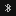
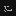
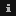
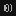
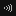

# dzen-dhall plugins

A set of curated plugins for [dzen-dhall](https://github.com/dzen-dhall/dzen-dhall).

Follow [the instructions](https://github.com/dzen-dhall/dzen-dhall#installing-plugins) to install any of them.

You are welcome to contribute yours via pull requests. The advantage of doing so is that your plugins will be updated by maintainer(s) in case of a breaking API change, and other users will be able to easily discover your code.

# Requirements

To be merged into this repo, a plugin must fulfill these requirements:

- It must not contain URL imports in dhall code. We aim to support fully offline usage.
- `usage` section of the meta field should contain a complete example that is ready to be copy-pasted by users to their `config.dhall`s.
- Plugin code should be human-readable.
- If a plugin emits events or contains automata, it should be wrapped in a separate [`scope`](https://github.com/dzen-dhall/dzen-dhall#scopes).
- If a plugin calls binaries, it should check if they are present in `PATH` using [assertions](https://github.com/dzen-dhall/dzen-dhall#assertions). If it depends on particular versions of the binaries, it should contain a `SuccessfulExit` assertion where version checks should be performed.
- `description` should not contain distribution-specific instructions for installing depndencies, e.g. "run `apt-get install foo`" is bad, "Install `foo` using you package manager" is good.

# Good advices

These are optional, but always good to have.

- A plugin should be fixed-width, i.e. occupy the same area on the screen during runtime. Use [trimming](https://github.com/dzen-dhall/dzen-dhall#trimming-text) and [padding](https://github.com/dzen-dhall/dzen-dhall#padding-text) functions to achieve this.
- Put a `preview.png` of your plugin in its folder (if applicable), and add a new entry to the list below (preserving alphabetic ordering).

# Catalogue

A list of all available plugins.

## date

A wrapper over `date` binary, prints current date formatted according to a given format string.

Run `dzen-dhall plug date` to install.

<details><summary><strong>Show usage</strong></summary>
<p>

```dhall
let date = (./plugins/date.dhall).main

in plug (date "%d.%m.%Y %A - %H:%M:%S")
```

</p>
</details>

## icons

A pack of XBM icons.


<details><summary><strong>Show detailed previews</strong></summary>
<p>


| Name           | Preview                                                                     |
|----------------|-----------------------------------------------------------------------------|
| `ac_01`        |                |
| `ac`           |                      |
| `alert`        |                |
| `arch_10x10`   |      |
| `arch`         |                  |
| `ball`         |                  |
| `bat_empty_01` |  |
| `bat_empty_02` |  |
| `bat_full_01`  |    |
| `bat_full_02`  |    |
| `bat_low_01`   |      |
| `bat_low_02`   |      |
| `battery`      |            |
| `bluetooth`    |        |
| `bug_01`       |              |
| `bug_02`       |              |
| `cat`          |                    |
| `clock`        |                |
| `cpu`          |                    |
| `dish`         |                  |
| `diskette`     |          |
| `empty`        |                |
| `envelope`     |          |
| `eye_l`        |                |
| `eye_r`        |                |
| `fox`          |                    |
| `fs_01`        |                |
| `fs_02`        |                |
| `full`         |                  |
| `fwd`          |                    |
| `half`         |                  |
| `info_01`      |            |
| `info_02`      |            |
| `info_03`      |            |
| `mail`         |                  |
| `mem`          |                    |
| `mouse_01`     |          |
| `music`        |                |
| `net_down_01`  |    |
| `net_down_02`  |    |
| `net_down_03`  |    |
| `net_up_01`    |        |
| `net_up_02`    |        |
| `net_up_03`    |        |
| `net_wired`    |        |
| `next`         |                  |
| `note`         |                  |
| `pacman`       |              |
| `pause`        |                |
| `phones`       |              |
| `play`         |                  |
| `plug`         |                  |
| `prev`         |                  |
| `rwd`          |                    |
| `scorpio`      |            |
| `shroom`       |              |
| `spkr_01`      |            |
| `spkr_02`      |            |
| `spkr_03`      |            |
| `stop`         |                  |
| `temp`         |                  |
| `test`         |                  |
| `usb_02`       |              |
| `usb`          |                    |
| `volume`       |              |
| `wifi_01`      |            |
| `wifi_02`      |            |


</p>
</details>


Run `dzen-dhall plug icons` to install.

<details><summary><strong>Show usage</strong></summary>
<p>

```dhall
let icons = (./plugins/icons.dhall).main

in	join
  [ plug icons.ac_01
  , plug icons.ac
  , plug icons.alert
  , plug icons.arch_10x10
  , plug icons.arch
  , plug icons.ball
  , plug icons.bat_empty_01
  , plug icons.bat_empty_02
  , plug icons.bat_full_01
  , plug icons.bat_full_02
  , plug icons.bat_low_01
  , plug icons.bat_low_02
  , plug icons.battery
  , plug icons.bluetooth
  , plug icons.bug_01
  , plug icons.bug_02
  , plug icons.cat
  , plug icons.clock
  , plug icons.cpu
  , plug icons.dish
  , plug icons.diskette
  , plug icons.empty
  , plug icons.envelope
  , plug icons.eye_l
  , plug icons.eye_r
  , plug icons.fox
  , plug icons.fs_01
  , plug icons.fs_02
  , plug icons.full
  , plug icons.fwd
  , plug icons.half
  , plug icons.info_01
  , plug icons.info_02
  , plug icons.info_03
  , plug icons.mail
  , plug icons.mem
  , plug icons.mouse_01
  , plug icons.music
  , plug icons.net_down_01
  , plug icons.net_down_02
  , plug icons.net_down_03
  , plug icons.net_up_01
  , plug icons.net_up_02
  , plug icons.net_up_03
  , plug icons.net_wired
  , plug icons.next
  , plug icons.note
  , plug icons.pacman
  , plug icons.pause
  , plug icons.phones
  , plug icons.play
  , plug icons.plug
  , plug icons.prev
  , plug icons.rwd
  , plug icons.scorpio
  , plug icons.shroom
  , plug icons.spkr_01
  , plug icons.spkr_02
  , plug icons.spkr_03
  , plug icons.stop
  , plug icons.temp
  , plug icons.test
  , plug icons.usb_02
  , plug icons.usb
  , plug icons.volume
  , plug icons.wifi_01
  , plug icons.wifi_02
  ]
```

</p>
</details>
